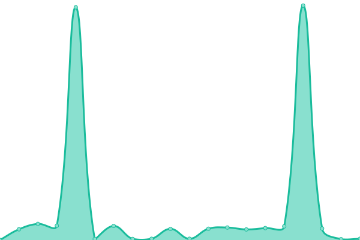

# [📈 Live Status](https://demo.upptime.js.org): <!--live status--> **🟧 Partial outage**

This repository contains the open-source uptime monitor and status page for [Upptime](https://upptime.js.org), powered by [Upptime](https://github.com/upptime/upptime).

With [Upptime](https://upptime.js.org), you can get your own unlimited and free uptime monitor and status page, powered entirely by a GitHub repository. We use [Issues](https://github.com/upptime/upptime/issues) as incident reports, [Actions](https://github.com/devetop/upptime/actions) as uptime monitors, and [Pages](https://demo.upptime.js.org) for the status page.

<!--start: status pages-->
<!-- This summary is generated by Upptime (https://github.com/upptime/upptime) -->
<!-- Do not edit this manually, your changes will be overwritten -->
<!-- prettier-ignore -->
| URL | Status | History | Response Time | Uptime |
| --- | ------ | ------- | ------------- | ------ |
|  [Bisacloud](https://bisacloud.com) | 🟩 Up | [bisacloud.yml](https://github.com/devetop/upptime/commits/HEAD/history/bisacloud.yml) | 

 154ms
     
 | 

<a href="https://uptime-bsc.pages.dev/history/bisacloud">98.74%</a>
    

|  [Bisacloud Blog](https://bisacloud.my.id) | 🟩 Up | [bisacloud-blog.yml](https://github.com/devetop/upptime/commits/HEAD/history/bisacloud-blog.yml) | 

 259ms
     
 | 

<a href="https://uptime-bsc.pages.dev/history/bisacloud-blog">99.31%</a>
    

|  [Erfan Portofolio](https://rfan.my.id) | 🟩 Up | [erfan-portofolio.yml](https://github.com/devetop/upptime/commits/HEAD/history/erfan-portofolio.yml) | 

 376ms
     
 | 

<a href="https://uptime-bsc.pages.dev/history/erfan-portofolio">99.17%</a>
    

|  [Dewa Kamera](https://dewakamera.com) | 🟩 Up | [dewa-kamera.yml](https://github.com/devetop/upptime/commits/HEAD/history/dewa-kamera.yml) | 

 1530ms
     
 | 

<a href="https://uptime-bsc.pages.dev/history/dewa-kamera">96.96%</a>
    

|  [IDwebhost](https://idwebhost.com) | 🟩 Up | [i-dwebhost.yml](https://github.com/devetop/upptime/commits/HEAD/history/i-dwebhost.yml) | 

 918ms
     
 | 

<a href="https://uptime-bsc.pages.dev/history/i-dwebhost">98.74%</a>
    

|  [PintarTekno.ID](https://pintartekno.id) | 🟩 Up | [pintar-tekno-id.yml](https://github.com/devetop/upptime/commits/HEAD/history/pintar-tekno-id.yml) | 

 1738ms
     
 | 

<a href="https://uptime-bsc.pages.dev/history/pintar-tekno-id">100.00%</a>
    

|  [Tonjoo](https://tonjoo.com) | 🟩 Up | [tonjoo.yml](https://github.com/devetop/upptime/commits/HEAD/history/tonjoo.yml) | 

 1995ms
     
 | 

<a href="https://uptime-bsc.pages.dev/history/tonjoo">99.82%</a>
    

|  [Future Skills](https://futureskills.id) | 🟩 Up | [future-skills.yml](https://github.com/devetop/upptime/commits/HEAD/history/future-skills.yml) | 

 3164ms
     
 | 

<a href="https://uptime-bsc.pages.dev/history/future-skills">99.34%</a>
    

|  [Polygon Bikes](https://www.polygonbikes.com) | 🟩 Up | [polygon-bikes.yml](https://github.com/devetop/upptime/commits/HEAD/history/polygon-bikes.yml) | 

 1445ms
     
 | 

<a href="https://uptime-bsc.pages.dev/history/polygon-bikes">100.00%</a>
    

|  [Taiga](https://tree.taiga.io) | 🟥 Down | [taiga.yml](https://github.com/devetop/upptime/commits/HEAD/history/taiga.yml) | 

 859ms
     
 | 

<a href="https://uptime-bsc.pages.dev/history/taiga">98.79%</a>
    

<!--end: status pages-->

[**Visit our status website →**](https://demo.upptime.js.org)

## 📄 License

- Powered by: [Upptime](https://github.com/upptime/upptime)
- Code: [MIT](./LICENSE) © [Anand Chowdhary](https://anandchowdhary.com), supported by [Pabio](https://pabio.com)
- Data in the `./history` directory: [Open Database License](https://opendatacommons.org/licenses/odbl/1-0/)
